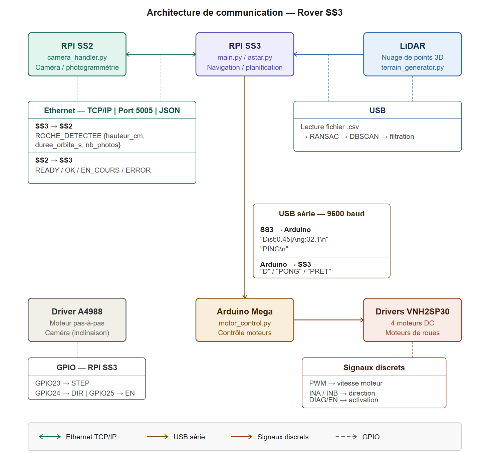
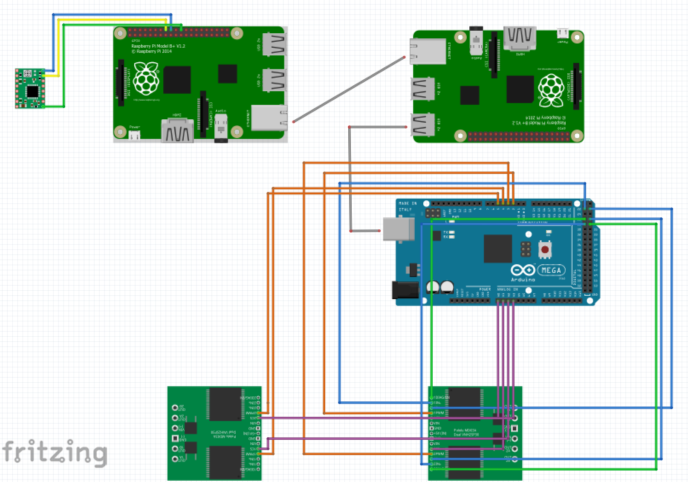
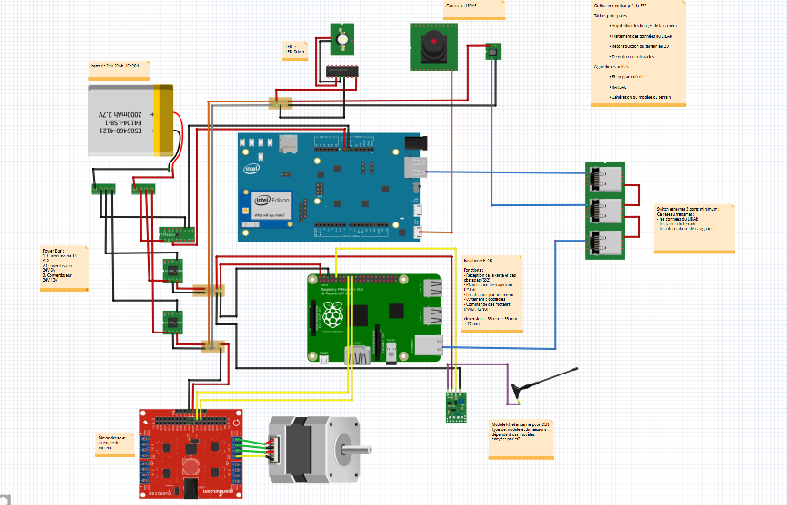

# Rover lunaire SS3 — Guidage, localisation et communication

Système de navigation autonome développé dans le cadre de la mission analogique Artémis II à Polytechnique Montréal (AER1110, Hiver 2026). SS3 gère la perception du terrain, le pathfinding et la communication entre les sous-systèmes.

**Équipe C3** — A. Achour, A. Benelbadaoui, E. Boutin, A. St-Pierre, O. Perreault

---

## Architecture de communication



---

## Assemblage matériel




---

## Lancer la simulation

```bash
python main.py
```

Par défaut, `SIMULATION_MODE = True` dans `main.py` — aucune connexion Arduino ni SS2 requise. Mettre à `False` pour la mission réelle.

---

## Configuration

Tous les paramètres (seuils RANSAC, DBSCAN, résolution de grille, rayon d'orbite, ports série et réseau) sont centralisés dans `config.py`.
